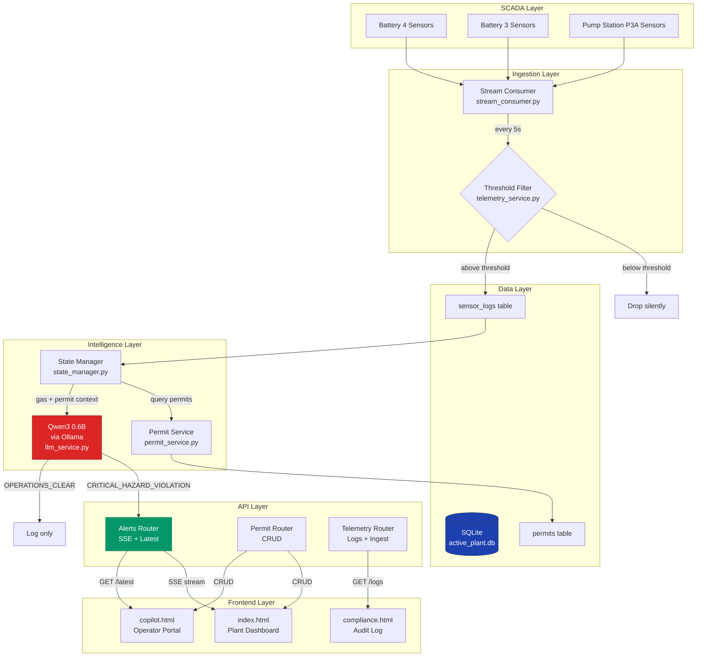
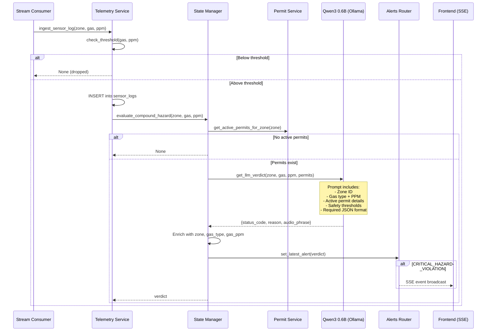
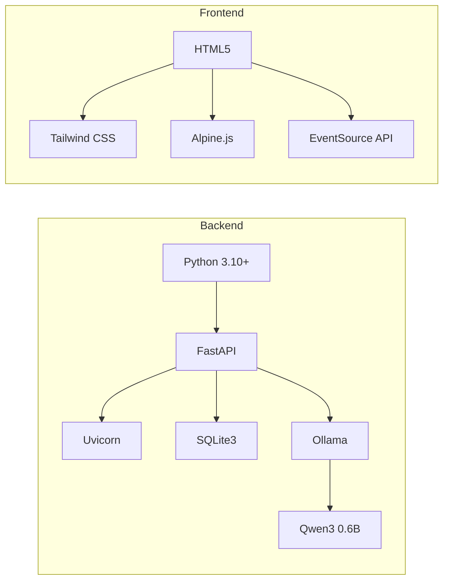

# Cerberus OS — Architecture Document

## System Overview

Cerberus OS is a local-first, event-driven industrial safety platform that detects **compound hazards** — situations where elevated gas levels coincide with active work permits in the same zone. It runs entirely on-device with no cloud dependencies.

---

## System Diagram



---

## Model Pipeline

### Inference Flow



---

## Data Flow

### Sensor Data Path

```
Raw Reading → Threshold Check → DB Insert → Permit Lookup → LLM Evaluation → Alert Broadcast
     ↓              ↓                                              ↓
  (all data)    (filtered ~70%)                              (only ~5% reach LLM)
```

**Key optimization**: The system is designed as a funnel. Most readings never reach the expensive LLM inference step.

| Stage | Data Volume | Latency |
|-------|-------------|---------|
| Raw sensor reading | 100% | <1 ms |
| Threshold filter | ~30% pass | <1 ms |
| DB insert + permit lookup | ~30% | <10 ms |
| LLM inference | ~5% (only when permits exist) | 1-3 seconds |
| Alert broadcast | <1% | <10 ms |

---

## Local vs Cloud Components

### Fully Local (No Internet Required)

| Component | Technology | Runs Where |
|-----------|-----------|------------|
| REST API Server | FastAPI + Uvicorn | Local CPU |
| Database | SQLite3 | Local disk |
| LLM Inference | Qwen3 0.6B via Ollama | Local CPU/GPU |
| Threshold Evaluation | Python logic | Local CPU |
| Permit Management | SQLite CRUD | Local CPU |
| SSE Alert Stream | FastAPI StreamingResponse | Local CPU |
| Frontend | Static HTML + JS | Browser |

### Internet Required (Setup Only)

| Component | When | Purpose |
|-----------|------|---------|
| `pip install` | First setup | Download Python packages |
| `ollama pull` | First setup | Download model weights (~400 MB) |
| CDN scripts | Page load | Tailwind CSS + Alpine.js (can be cached/bundled) |

> **After initial setup, the entire system runs air-gapped.** This is critical for industrial plants where internet may be restricted or unavailable.

---

## Key Design Decisions

### 1. Compound Hazard Only

**Decision**: Only trigger alerts when gas AND permit coexist.

**Rationale**: Gas sensors trigger constantly in industrial environments. Permit systems process continuously. Alerting on either alone would create alert fatigue. The real danger is the **intersection** — when humans are working in a zone with elevated gas.

### 2. Small Local Model (0.6B)

**Decision**: Use Qwen3:0.6B instead of a larger model.

**Rationale**:
- Runs on any modern laptop CPU without GPU
- ~400 MB disk footprint (quantized)
- 1-3 second inference — fast enough for safety alerts
- Deterministic with `temperature: 0`
- Structured JSON output is well within 0.6B capability

**Trade-off**: Borderline cases may be less accurate than a 7B+ model, but the threshold pre-filter handles most edge cases before reaching the LLM.

### 3. SQLite Over PostgreSQL

**Decision**: Use SQLite with WAL mode (`journal_mode=WAL`) and `timeout=30`.

**Rationale**:
- Zero configuration, no separate database server
- Single-file deployment
- Sufficient for single-plant, single-shift usage
- WAL mode ensures readers never block writers and writers never block readers
- `timeout=30` prevents lock failures during concurrent consumer writes

**Trade-off**: Not suitable for multi-plant or distributed deployment.

### 4. SSE Over WebSocket for Alerts

**Decision**: Use Server-Sent Events instead of WebSocket.

**Rationale**:
- Unidirectional (server → client) is sufficient for alerts
- Simpler implementation
- Automatic reconnection built into `EventSource` API
- Works through HTTP proxies and firewalls

### 5. Threshold Pre-Filter

**Decision**: Drop readings below safe limits before any DB or AI interaction.

**Rationale**:
- Reduces DB writes by ~70%
- Reduces LLM calls by ~95%
- Keeps the system responsive under high sensor frequency
- Safety thresholds are based on OISD standards

### 6. No Authentication

**Decision**: API endpoints are open with `allow_origins=["*"]`.

**Rationale**: Designed for isolated plant LANs where the network itself is the security boundary. Adding auth would complicate deployment in environments where IT support is minimal.

**Risk**: Must not be exposed to public networks.

### 7. Robust JSON Extraction

**Decision**: Extract JSON using `raw[raw.find("{"):raw.rfind("}")+1]` instead of markdown stripping.

**Rationale**: Small LLMs frequently wrap JSON in explanation text, markdown fences, or thinking tokens. Brace-finding is the most reliable extraction method across model variations.

### 8. Error-Resilient Consumer Loop

**Decision**: Wrap `ingest_sensor_log()` in try/except within the stream consumer.

**Rationale**: A single failed DB write or LLM timeout must not kill the entire sensor ingestion loop. The consumer must stay alive to process subsequent readings.

---

## Technology Stack Summary



---

## Security Boundary

```
┌──────────────────────────────────────────┐
│              Plant LAN (Air-gapped)       │
│                                          │
│  ┌─────────┐     ┌──────────┐            │
│  │ SCADA   │────▶│ Cerberus │            │
│  │ Sensors │     │ Backend  │            │
│  └─────────┘     │ :8000    │            │
│                  └────┬─────┘            │
│                       │                  │
│              ┌────────┴────────┐         │
│              │                 │         │
│         ┌────▼─────┐    ┌─────▼────┐    │
│         │ Frontend │    │ Ollama   │    │
│         │ :3000    │    │ LLM      │    │
│         └──────────┘    └──────────┘    │
│                                          │
│  No data leaves this boundary            │
└──────────────────────────────────────────┘
```
