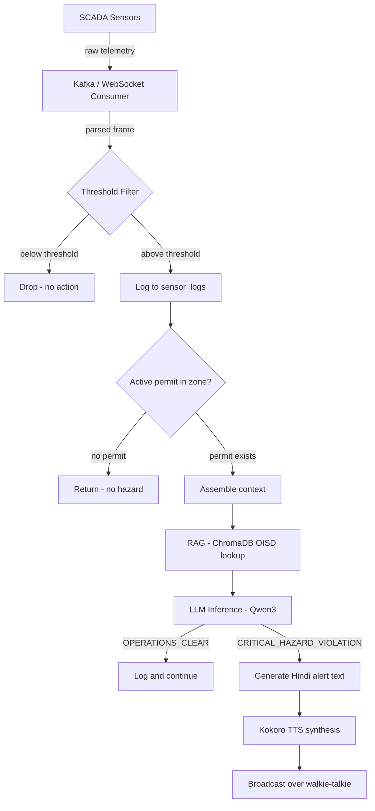
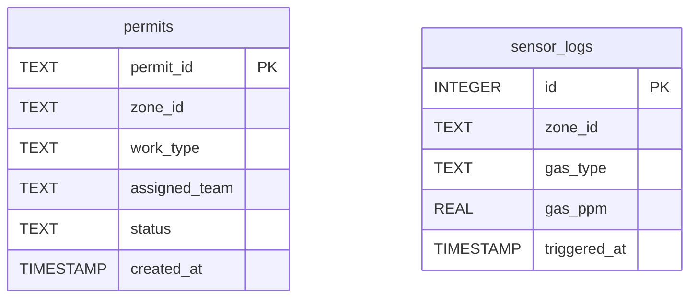
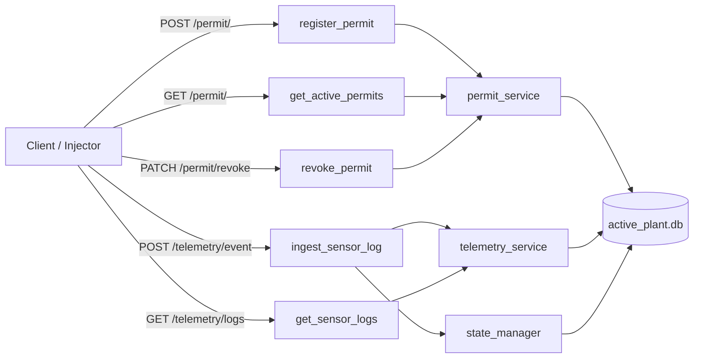

# Cereberus OS

Air-gapped, local, event-driven industrial safety intelligence engine for heavy manufacturing plants.

---

## The Problem

Indian heavy industry plants run two completely disconnected systems. SCADA sensors track gas levels continuously. Work permit systems track which teams are authorized to work in which zones. Neither system talks to the other.

A welding crew can walk into a zone with an active hot work permit while CO levels are quietly rising. The sensor sees the gas. The permit system sees the crew. Nothing connects the two. By the time a supervisor notices the overlap manually, it is too late.

This is not a hardware problem. The sensors work. The permits exist. The failure is the absence of an automated coordination layer between them.

Cereberus OS is that layer.

---

## What It Does

Cereberus OS listens to incoming sensor telemetry, filters out normal readings, and cross-references dangerous readings against active work permits in the same zone. When both conditions are present simultaneously — elevated gas and human activity — it declares a compound hazard violation and broadcasts a voice alert in Hindi directly over the zone's radio channel.

A single gas spike alone does not trigger an alert. A permit alone does not trigger an alert. Only the combination does. This is the core design decision.

---

## Architecture

The system is built in four layers:

**Stream Ingestion**
Async WebSocket and Kafka consumer workers listen to the SCADA broker continuously. Incoming telemetry frames are parsed and passed to the threshold filter. Readings below safe limits are dropped immediately without touching any AI component.

**Active State Database**
SQLite stores the current live state of the plant — active permits, zone assignments, work types, team details, and flagged sensor readings. This is the short-term memory of the system. It does not store historical data from previous shifts.

**Compound Risk Evaluator**
The state manager cross-references the flagged sensor reading against active permits for the same zone. If a conflict exists, it assembles the full context — gas type, PPM value, permit type, team details — and passes it to the local LLM for a structured verdict. The LLM returns either CRITICAL_HAZARD_VIOLATION or OPERATIONS_CLEAR along with a Hindi audio phrase.

**Floor Voice Gateway**
Faster-Whisper handles Hindi speech-to-text from operator walkie-talkies. Kokoro-82M handles text-to-speech synthesis for alert broadcast. Both run entirely on local hardware with no cloud dependency.

---

## Full System Flow


## DB Schema



## API Routes


## Project Structure

```
CEREBERUS OS/
├── db/
│   ├── data/
│   │   └── active_plant.db
│   └── db.py
├── models/
│   ├── enums.py
│   ├── permit.py
│   └── telemetry.py
├── routers/
│   ├── permit_router.py
│   └── telemetry_router.py
├── services/
│   ├── permit_service.py
│   ├── telemetry_service.py
│   └── state_manager.py
├── injector.py
├── main.py
└── requirements.txt
```

---

## Gas Thresholds

Readings below these values are dropped before any processing occurs:

| Gas | Threshold | Unit |
|-----|-----------|------|
| CO  | 1.5       | PPM  |
| H2S | 5.0       | PPM  |
| CH4 | 1.0       | % LEL |
| O2  | below 19.5 | % volume |
| SO2 | 2.0       | PPM  |

---

## API Endpoints

| Method | Route | Description |
|--------|-------|-------------|
| POST | /permit/ | Register a new work permit |
| GET | /permit/ | Get all active permits |
| PATCH | /permit/revoke | Revoke an active permit |
| POST | /telemetry/event | Ingest a sensor reading |
| GET | /telemetry/logs | Get all flagged sensor logs |
| GET | / | Health check |

---

## Demo Flow

1. Start the server: `uvicorn main:app --reload`
2. Run the injector: `python injector.py`
3. The injector registers a hot work permit for Battery 4
4. It then sends a CO reading of 2.4 PPM for Battery 4
5. The terminal prints a CRITICAL_HAZARD_VIOLATION verdict

---

## Setup

```bash
python -m venv .venv
source .venv/bin/activate        # Windows: .venv\Scripts\activate
pip install -r requirements.txt
uvicorn main:app --reload
```

---

## Current Status

Backend core is complete and tested. Compound hazard detection is working end to end with a stubbed LLM verdict. The following components are pending and require a GPU machine:

- ChromaDB vector store with OISD and Factory Act corpus
- Local LLM inference via llama.cpp replacing the stub verdict
- Faster-Whisper Hindi STT
- Kokoro-82M TTS voice alert broadcast
- Frontend dashboard

---

## Tech Stack

- Python, FastAPI, SQLite, Kafka
- ChromaDB, SentenceTransformers (pending)
- llama.cpp, Qwen3-14B GGUF (pending)
- Faster-Whisper, Kokoro-82M (pending)
- HTML, Tailwind CSS, Alpine.js, Vis.js (pending)
