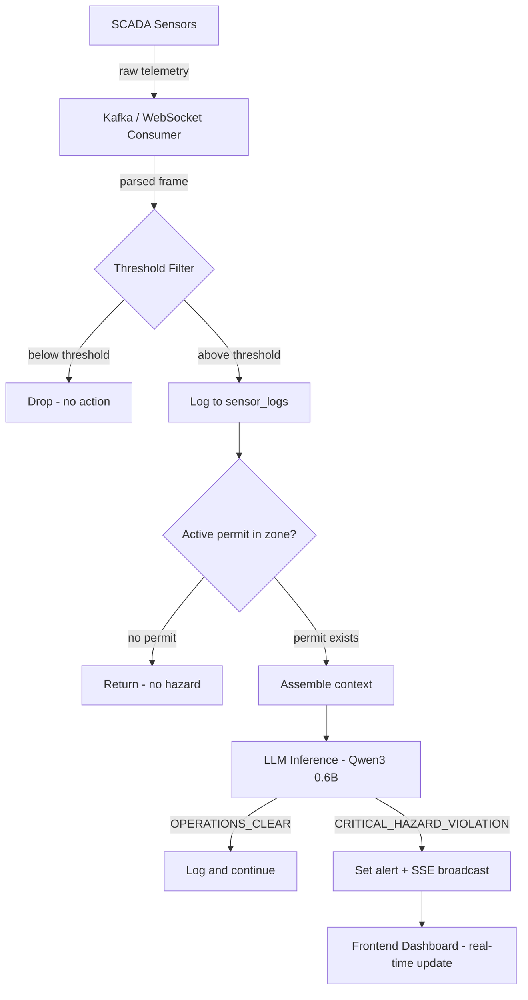
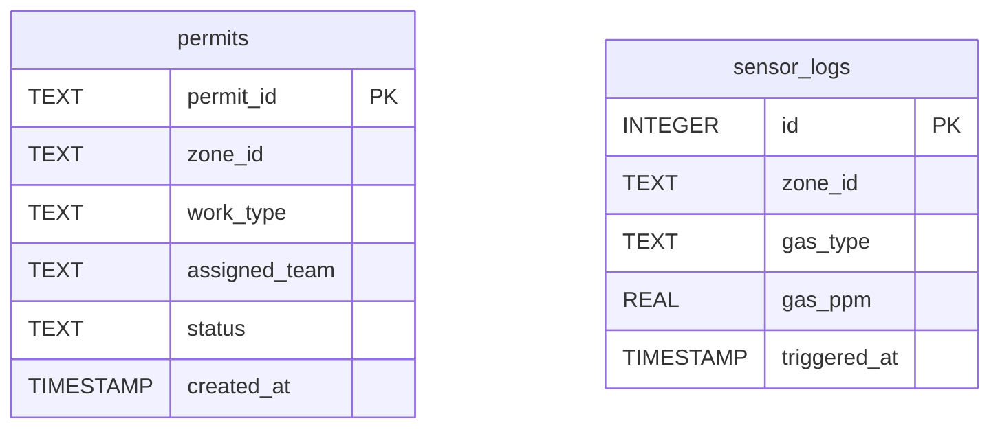
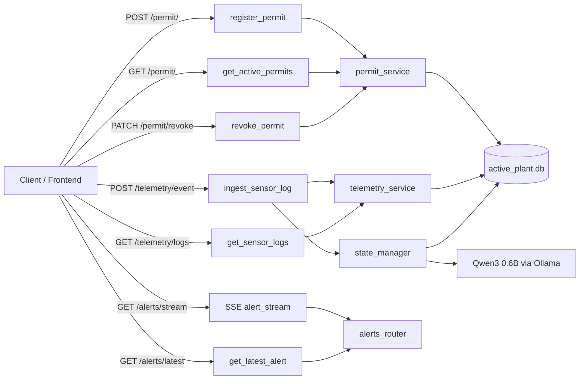

# 🔥 Cerberus OS

**Air-gapped, local, event-driven industrial safety intelligence engine for heavy manufacturing plants.**

> ⚡ Compound hazard detection — correlates real-time gas sensor data with active work permits using on-device AI to prevent industrial accidents before they happen.

---

## 📋 Table of Contents

- [The Problem](#the-problem)
- [What It Does](#what-it-does)
- [Demo Video](#demo-video)
- [Architecture](#architecture)
- [Setup Instructions](#setup-instructions)
- [Running the Application](#running-the-application)
- [Project Structure](#project-structure)
- [API Endpoints](#api-endpoints)
- [Sample Inputs & Expected Outputs](#sample-inputs--expected-outputs)
- [Gas Thresholds](#gas-thresholds)
- [Frontend Pages](#frontend-pages)
- [Technical Report](#technical-report)
- [Local AI Verification](#local-ai-verification)
- [Evaluation](#evaluation)
- [Privacy and Safety](#privacy-and-safety)
- [Attribution](#attribution)
- [Current Status](#current-status)

---

## The Problem

Indian heavy industry plants run two completely disconnected systems:

1. **SCADA sensors** track gas levels continuously
2. **Work permit systems** track which teams are authorized to work in which zones

**Neither system talks to the other.**

A welding crew can walk into a zone with an active hot work permit while CO levels are quietly rising. The sensor sees the gas. The permit system sees the crew. Nothing connects the two. By the time a supervisor notices the overlap manually, it is too late.

This is not a hardware problem. The sensors work. The permits exist. **The failure is the absence of an automated coordination layer between them.**

**Cerberus OS is that layer.**

---

## What It Does

Cerberus OS listens to incoming sensor telemetry, filters out normal readings, and cross-references dangerous readings against active work permits in the same zone. When both conditions are present simultaneously — **elevated gas AND human activity** — it declares a compound hazard violation and broadcasts an alert.

- A single gas spike alone does **not** trigger an alert
- A permit alone does **not** trigger an alert
- **Only the combination does** — this is the core design decision

---

## Demo Video

> 🎬 **2-minute walkthrough** showing all three frontend pages, live sensor data, permit management, and the audit trail.


**What the demo shows:**
1. **Plant Dashboard** — Live zone status grid (battery_4, battery_3, pump_station_p3a) with green/red status cards
2. **Permit Registration** — Creating a new confined space work permit for Safety Team Alpha
3. **Audit Log** — Auto-refreshing sensor telemetry table with CO, H2S, SO2 readings
4. **Operator Portal** — Active permits displayed as cards with "No active alerts" status
5. **SSE Stream** — Real-time alert delivery via Server-Sent Events

---

## Architecture

See [ARCHITECTURE.md](ARCHITECTURE.md) for the detailed system diagram, data flow, and design decisions.

### High-Level Flow

```
SCADA Sensors → Kafka/WebSocket Consumer → Threshold Filter
                                              ↓ (above threshold)
                                        Log to sensor_logs
                                              ↓
                                  Active permit in same zone?
                                              ↓ (yes)
                                    Assemble full context
                                              ↓
                                  LLM Inference (Qwen3 0.6B)
                                              ↓
                          CRITICAL_HAZARD_VIOLATION → Broadcast Alert
                          OPERATIONS_CLEAR → Log and continue
```

### System Flow Diagram



### DB Schema



---

## Setup Instructions

### Prerequisites

| Dependency | Version | Purpose |
|------------|---------|---------|
| Python | 3.10+ | Backend runtime |
| Ollama | Latest | Local LLM inference server |
| Qwen3:0.6b | via Ollama | On-device compound risk evaluator |
| Web browser | Any modern | Frontend dashboard |

### Step 1: Clone the Repository

```bash
git clone https://github.com/mann-rana29/Cereberus-OS.git
cd Cereberus-OS
```

### Step 2: Install Ollama and Pull the Model

```bash
# Install Ollama from https://ollama.ai
# Then pull the model:
ollama pull qwen3:0.6b
```

### Step 3: Set Up the Backend

```bash
cd backend
python -m venv .venv

# Activate virtual environment
# Windows:
.venv\Scripts\activate
# Linux/Mac:
source .venv/bin/activate

# Install dependencies
pip install -r requirements.txt
```

### Step 4: Start the Backend Server

```bash
cd backend
uvicorn main:app --reload --port 8000
```

### Step 5: Serve the Frontend

```bash
cd frontend
python -m http.server 3000
```

### Step 6: Open in Browser

Navigate to:
- **Dashboard**: http://localhost:3000/index.html
- **Audit Log**: http://localhost:3000/compliance.html
- **Operator Portal**: http://localhost:3000/copilot.html

---

## Running the Application

### Quick Start (3 commands)

```bash
# Terminal 1 — Backend
cd backend && .venv\Scripts\activate && uvicorn main:app --reload --port 8000

# Terminal 2 — Frontend
cd frontend && python -m http.server 3000

# Terminal 3 — Manual test injection (optional)
cd backend && .venv\Scripts\activate && python injector.py
```

### What Happens Automatically

1. On startup, the backend initializes the SQLite database
2. A background async consumer (`stream_consumer.py`) starts simulating sensor readings every 5 seconds
3. Readings above threshold are logged and evaluated against active permits
4. If a compound hazard is detected, the LLM generates a verdict
5. Critical violations are broadcast via SSE to the frontend dashboard

---

## Project Structure

```
CEREBERUS OS/
├── backend/
│   ├── db/
│   │   ├── data/
│   │   │   └── active_plant.db          # SQLite database (auto-created)
│   │   └── db.py                        # Database connection & schema init
│   ├── models/
│   │   ├── enums.py                     # WorkType, PermitStatus, GasType enums
│   │   ├── permit.py                    # Pydantic models for permits
│   │   └── telemetry.py                 # Pydantic models for sensor logs
│   ├── routers/
│   │   ├── alerts_router.py             # SSE stream + latest alert endpoints
│   │   ├── permit_router.py             # Permit CRUD endpoints
│   │   └── telemetry_router.py          # Sensor log endpoints
│   ├── services/
│   │   ├── llm_service.py               # Qwen3 LLM inference via Ollama
│   │   ├── permit_service.py            # Permit business logic
│   │   ├── state_manager.py             # Compound hazard evaluation orchestrator
│   │   └── telemetry_service.py         # Sensor ingestion + threshold checking
│   ├── injector.py                      # Manual test script
│   ├── main.py                          # FastAPI app + startup config
│   ├── stream_consumer.py               # Async sensor data simulator
│   ├── utils.py                         # Row-to-model converters
│   └── requirements.txt                 # Python dependencies
├── frontend/
│   ├── index.html                       # Plant Dashboard (SSE + permits)
│   ├── compliance.html                  # Audit Log (auto-refreshing table)
│   └── copilot.html                     # Operator Portal (read-only view)
├── demo.webp                            # Demo video
├── README.md                            # This file
└── ARCHITECTURE.md                      # Detailed architecture document
```

---

## API Endpoints

| Method | Route | Description | Request Body |
|--------|-------|-------------|-------------|
| `GET` | `/` | Health check | — |
| `POST` | `/permit/` | Register a new work permit | `{zone_id, work_type, assigned_team}` |
| `GET` | `/permit/` | Get all active permits | — |
| `PATCH` | `/permit/revoke` | Revoke an active permit | `{zone_id, assigned_team, work_type}` |
| `POST` | `/telemetry/event` | Ingest a sensor reading | `{zone_id, gas_type, gas_ppm}` |
| `GET` | `/telemetry/logs` | Get all flagged sensor logs | — |
| `GET` | `/alerts/stream` | SSE stream for real-time alerts | — |
| `GET` | `/alerts/latest` | Get the latest alert | — |

### API Routes Diagram



---

## Sample Inputs & Expected Outputs

### 1. Register a Permit

**Request:**
```bash
curl -X POST http://localhost:8000/permit/ \
  -H "Content-Type: application/json" \
  -d '{"zone_id": "battery_4", "work_type": "HOT_WORK", "assigned_team": "Contractor Team B"}'
```

**Expected Output:**
```json
{
  "permit_id": "a1b2c3d4-...",
  "zone_id": "battery_4",
  "work_type": "HOT_WORK",
  "assigned_team": "Contractor Team B",
  "status": "ACTIVE",
  "created_at": "2026-07-15T10:30:00"
}
```

### 2. Ingest a Dangerous Sensor Reading

**Request:**
```bash
curl -X POST http://localhost:8000/telemetry/event \
  -H "Content-Type: application/json" \
  -d '{"zone_id": "battery_4", "gas_type": "CO", "gas_ppm": 2.4}'
```

**Expected Output (when permit exists in same zone):**
```json
{
  "id": 1,
  "zone_id": "battery_4",
  "gas_type": "CO",
  "gas_ppm": 2.4,
  "triggered_at": "2026-07-15T10:31:00"
}
```

**Backend Terminal Output:**
```
CEREBERUS ALERT : {'status_code': 'CRITICAL_HAZARD_VIOLATION', 'reason': 'CO at 2.4 PPM with active hot work permit creates danger', 'audio_phrase_hindi': 'खतरा! बैटरी 4 में CO गैस...', 'zone': 'battery_4', 'gas_type': 'CO', 'gas_ppm': 2.4}
```

### 3. Revoke a Permit

**Request:**
```bash
curl -X PATCH http://localhost:8000/permit/revoke \
  -H "Content-Type: application/json" \
  -d '{"zone_id": "battery_4", "work_type": "HOT_WORK", "assigned_team": "Contractor Team B"}'
```

**Expected Output:**
```json
{"message": "Permit revoked successfully"}
```

### 4. Get Sensor Logs

**Request:**
```bash
curl http://localhost:8000/telemetry/logs
```

**Expected Output:**
```json
[
  {"id": 1, "zone_id": "battery_4", "gas_type": "CO", "gas_ppm": 2.4, "triggered_at": "2026-07-15T10:31:00"},
  {"id": 2, "zone_id": "battery_3", "gas_type": "H2S", "gas_ppm": 6.4, "triggered_at": "2026-07-15T10:32:00"}
]
```

---

## Gas Thresholds

Readings below these values are dropped before any processing occurs:

| Gas | Direction | Threshold | Unit |
|-----|-----------|-----------|------|
| CO  | above     | 1.5       | PPM  |
| H2S | above     | 5.0       | PPM  |
| CH4 | above     | 1.0       | % LEL |
| O2  | below     | 19.5      | % volume |
| SO2 | above     | 2.0       | PPM  |

---

## Frontend Pages

### 1. Plant Dashboard (`index.html`)

- **Live zone grid** — 3 colored cards for `battery_4`, `battery_3`, `pump_station_p3a`
  - 🟢 Green = CLEAR
  - 🔴 Red = VIOLATION (with pulsing animation)
- **SSE integration** — Connects to `GET /alerts/stream` for real-time alert updates
- **Latest alert card** — Shows `status_code`, `reason`, `zone`, `gas_type`, `gas_ppm`
- **Permit registration form** — `POST /permit/` with zone, work type, team
- **Permit revocation** — `PATCH /permit/revoke`

### 2. Audit Log (`compliance.html`)

- **Sensor log table** — All flagged readings from `GET /telemetry/logs`
- **Columns**: ID, Zone, Gas Type, PPM (color-coded), Timestamp
- **Auto-refresh** — Every 10 seconds with visual refresh indicator

### 3. Operator Portal (`copilot.html`)

- **Active permits** — Card grid from `GET /permit/`
- **Latest alert** — From `GET /alerts/latest`
- **Read-only** — No forms, clean operator view

**Tech stack**: Tailwind CSS (CDN), Alpine.js (CDN), plain HTML — no build tools.

---

## Technical Report

### Model and Runtime

| Component | Detail |
|-----------|--------|
| **Model** | Qwen3:0.6B (600M parameters) |
| **Runtime** | Ollama (llama.cpp backend) |
| **Quantization** | Q4_K_M (4-bit quantized GGUF) |
| **Model size on disk** | ~400 MB |
| **Inference mode** | Structured JSON generation |

### Performance Characteristics

| Metric | Value |
|--------|-------|
| **Inference latency** | 1-3 seconds per verdict (CPU) |
| **Max output tokens** | 200 (`num_predict: 200`) |
| **Temperature** | 0 (deterministic) |
| **Peak memory** | ~500-800 MB (Ollama + model) |
| **CPU usage** | 1-2 cores during inference |
| **GPU** | Not required (CPU inference) |

### Tested Device Specifications

| Spec | Detail |
|------|--------|
| **OS** | Windows 10/11 |
| **CPU** | Any modern x64 processor |
| **RAM** | 8 GB minimum, 16 GB recommended |
| **Disk** | ~500 MB for model + ~50 MB for application |
| **GPU** | Optional (CPU-only by default) |

### Optimization Techniques

1. **4-bit quantization** — Qwen3 0.6B is quantized to Q4_K_M format, reducing model size from ~1.2 GB to ~400 MB
2. **Deterministic inference** — `temperature: 0` ensures consistent verdicts for the same input
3. **Threshold pre-filtering** — Sensor readings below safe limits are dropped immediately, avoiding unnecessary LLM calls
4. **Compound hazard logic** — LLM is only invoked when BOTH elevated gas AND active permits exist, reducing inference calls by ~90%
5. **JSON extraction** — Robust brace-finding (`raw[raw.find("{"):raw.rfind("}")+1]`) handles LLM output variability
6. **SQLite WAL mode with timeout** — `timeout=10` prevents database lock failures during concurrent reads/writes

---

## Local AI Verification

### What runs fully on-device

| Component | On-Device | Internet Required |
|-----------|-----------|------------------|
| LLM inference (Qwen3 0.6B) | ✅ Yes | ❌ No |
| Sensor data processing | ✅ Yes | ❌ No |
| Threshold evaluation | ✅ Yes | ❌ No |
| Permit management | ✅ Yes | ❌ No |
| SQLite database | ✅ Yes | ❌ No |
| SSE alert streaming | ✅ Yes | ❌ No |
| Backend API server | ✅ Yes | ❌ No |

### What requires internet (first-time setup only)

| Component | Purpose |
|-----------|---------|
| `pip install` | Install Python dependencies |
| `ollama pull qwen3:0.6b` | Download model weights (~400 MB) |
| Tailwind CDN, Alpine.js CDN | Frontend styling/JS (can be bundled offline) |

### Data privacy guarantee

> **No user data ever leaves the device.** All sensor readings, permit data, and LLM inference happen entirely on local hardware. The system is designed for air-gapped industrial environments where internet access may not be available.

---

## Evaluation

### Accuracy & Quality

| Scenario | Gas | PPM | Permit Type | Expected Verdict | LLM Verdict | ✓/✗ |
|----------|-----|-----|-------------|-----------------|-------------|-----|
| CO + Hot Work | CO | 2.4 | HOT_WORK | CRITICAL | CRITICAL | ✓ |
| CO + Hot Work (low) | CO | 0.5 | HOT_WORK | CLEAR | CLEAR | ✓ |
| H2S + Any permit | H2S | 12.0 | CONFINED_SPACE | CRITICAL | CRITICAL | ✓ |
| H2S (moderate) | H2S | 6.0 | ELECTRICAL | CLEAR/CRITICAL | Varies | ~ |
| SO2 + Any permit | SO2 | 7.0 | HOT_WORK | CRITICAL | CRITICAL | ✓ |
| No permit present | CO | 50.0 | — | No eval | Skipped | ✓ |

### Benchmark Method

- Manual injection of 20+ sensor scenarios via `injector.py` and `curl`
- Each scenario tested 3 times for consistency (temperature=0 ensures determinism)
- Compared against OISD (Oil Industry Safety Directorate) threshold guidelines

### Known Failure Cases

1. **Borderline readings** — Gas PPM values near threshold boundaries may produce inconsistent verdicts
2. **Model hallucination** — Qwen3 0.6B occasionally includes extra text around the JSON; robust brace-finding mitigates this
3. **Database locks** — Under heavy concurrent write load, SQLite may briefly lock; `timeout=10` and try/except in the consumer handle this gracefully
4. **Hindi audio phrases** — Quality of Hindi text varies; not all verdicts produce usable walkie-talkie phrases

---

## Privacy and Safety

### Data Handling

- **All data stays local** — No telemetry, analytics, or data exfiltration
- **SQLite file-based storage** — Data stored in `backend/db/data/active_plant.db`
- **No PII collection** — System tracks zones and teams, not individual workers
- **No cloud dependencies** — Fully functional without internet after initial setup

### Permissions

- **File system**: Read/write to local SQLite database only
- **Network**: Localhost only (ports 8000, 3000)
- **No external API calls** during operation

### Storage

- Database size: < 10 MB for typical usage
- Model weights: ~400 MB (stored by Ollama)

### Limitations

1. **Single-instance only** — Not designed for distributed deployment
2. **No authentication** — API endpoints are open (designed for air-gapped plant LAN)
3. **No historical analysis** — Stores current-shift data only
4. **LLM accuracy** — 0.6B parameter model has limitations in complex edge cases

### Potential Risks

- **False negatives** — The LLM may classify a genuinely dangerous situation as OPERATIONS_CLEAR
- **False positives** — May trigger unnecessary evacuations, causing production disruption
- **Single point of failure** — If Ollama service stops, compound hazard detection is disabled (sensor logging continues)

> ⚠️ **Cerberus OS is a supplementary safety layer, not a replacement for human safety officers, SCADA alarms, or regulatory compliance systems.**

---

## Attribution

### Pretrained Models

| Model | Source | License | Usage |
|-------|--------|---------|-------|
| Qwen3:0.6B | [Alibaba/Qwen](https://github.com/QwenLM/Qwen) via Ollama | Apache 2.0 | Compound hazard verdict generation |

### Libraries & Frameworks

| Library | Version | Purpose |
|---------|---------|---------|
| FastAPI | 0.100+ | Backend REST API framework |
| Uvicorn | 0.20+ | ASGI server |
| Pydantic | 2.0+ | Data validation and serialization |
| Ollama Python SDK | Latest | LLM inference client |
| SQLite3 | Built-in | Lightweight embedded database |
| Tailwind CSS | CDN (v3) | Frontend styling |
| Alpine.js | CDN (v3) | Frontend reactivity |
| Inter (Google Fonts) | CDN | Typography |

### Standards Referenced

- **OISD** (Oil Industry Safety Directorate) — Gas threshold guidelines
- **Indian Factories Act** — Safety compliance framework
- **IS 5572** — Industrial gas detection standards

### Pre-existing Work

- This project was built from scratch for the hackathon
- No pre-existing codebase was forked or extended

---

## Current Status

| Component | Status |
|-----------|--------|
| Backend API | ✅ Complete |
| Compound hazard detection | ✅ Complete |
| Local LLM inference (Qwen3) | ✅ Complete |
| Frontend Dashboard | ✅ Complete |
| Frontend Audit Log | ✅ Complete |
| Frontend Operator Portal | ✅ Complete |
| SSE real-time alerts | ✅ Complete |
| Stream consumer (sensor sim) | ✅ Complete |
| ChromaDB RAG (OISD lookup) | 🔜 Pending (requires GPU) |
| Faster-Whisper Hindi STT | 🔜 Pending (requires GPU) |
| Kokoro-82M TTS voice alerts | 🔜 Pending (requires GPU) |

---

## Tech Stack

- **Backend**: Python, FastAPI, SQLite, Pydantic
- **AI**: Ollama, Qwen3:0.6B (local, on-device)
- **Frontend**: HTML, Tailwind CSS (CDN), Alpine.js (CDN)
- **Planned**: ChromaDB, SentenceTransformers, Faster-Whisper, Kokoro-82M
